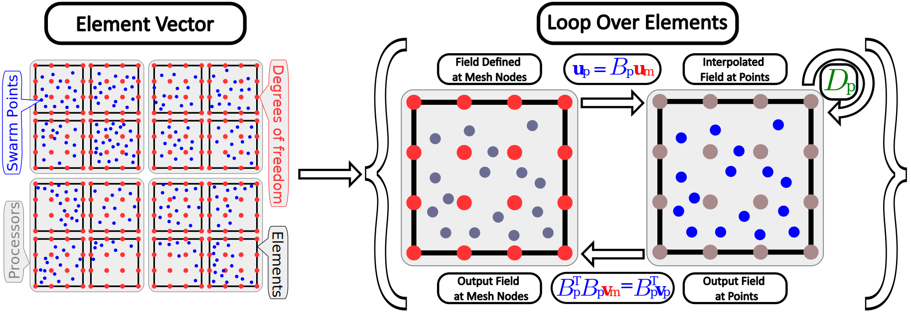

libCEED is a fast and portable matrix-free finite element code. It allows the same kernels to be run on CPU and GPU without rewriting source code.

My contributions include assembly of at-points operators on GPU, a necessary feature for Ratel iMPM, and various performance and usability enhancements.

<!--more-->
